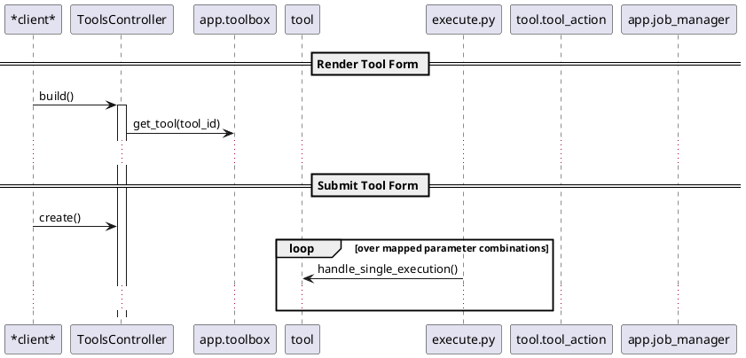

# Diagram Guide

Reference for creating effective diagrams in Galaxy architecture documentation. Used by `/plan-a-topic` command.

## Philosophy

Choose the diagram type that best communicates your point. These are patterns we've found effective - not rules. If a different diagram type serves your purpose better, use it.

## Diagram Types We Use

| Type | Purpose | Examples |
|------|---------|----------|
| **Sequence** | Call chains, request flows | asgi_app, core_tool_sequence, core_backend_celery |
| **Class/Object** | Data models, inheritance | core_runner_classes, hda_dataset, objectstore |
| **Component** | Package dependencies | core_packages |
| **File Mindmap** | Directory structure (validated) | core_files_ci, core_files_code |
| **Concept Mindmap** | Abstract relationships | markdown_design_principles, core_branches |
| **Mermaid Timeline** | Evolution over time | (see MERMAID.md) |
| **Mermaid Flowchart** | Decision trees, user flows | (see MERMAID.md) |

## Sequence Diagrams

Trace call chains through the system. Show what calls what and in what order.

### When to Use
- Request handling flow (browser → controller → manager)
- Tool execution pipeline
- Task processing (Celery flows)
- Any multi-component interaction

### Example: ASGI Request Flow
```plantuml
@startuml
!include plantuml_options.txt

participant Browser
participant "ASGI Server"
participant FastAPI
participant Starlette
participant Middleware
participant router
participant Controller
participant Service
participant Manager

note over "ASGI Server", router: Framework
note over Controller, Manager: Galaxy Backend

Browser -> "ASGI Server": TCP/IP Request
activate "ASGI Server"
"ASGI Server" -> FastAPI: asgi args
activate FastAPI

FastAPI -> Starlette: asgi args
activate Starlette

... (abbreviated) ...

Manager --> Service: pydantic
Service --> Controller: pydantic
Controller --> router: pydantic

@enduml
```

**Key patterns:**
- Use `activate`/`deactivate` for lifelines
- Add `note over X, Y: Label` to group components
- Use `==` sections to separate phases (e.g., "Render Tool Form", "Submit Tool Form")
- Use `group` for optional/conditional blocks
- Show data types passed between components (e.g., "pydantic", "json")

### Example: Tool Execution Sequence


**Key patterns:**
- Use `== Section ==` to separate logical phases
- Use `loop` for iteration
- Show method names in arrow labels

## Class/Object Diagrams

Show type hierarchies, model relationships, and interface structure.

### When to Use
- Plugin/runner inheritance hierarchies
- Data model relationships (HDA ↔ Dataset)
- Interface layering (StructuredApp hierarchy)
- Abstract class → concrete implementations

### Example: Inheritance Hierarchy
```plantuml
@startuml
!include plantuml_options.txt

package "galaxy.jobs.runners" {

abstract class BaseJobRunner {
}

abstract class AsynchronousJobRunner {
}

class LocalJobRunner {}
class DRMAAJobRunner {}
class SlurmJobRunner {}
class KubernetesJobRunner {}

}

BaseJobRunner <|-- AsynchronousJobRunner
BaseJobRunner <|-- LocalJobRunner
AsynchronousJobRunner <|-- DRMAAJobRunner
AsynchronousJobRunner <|-- KubernetesJobRunner
DRMAAJobRunner <|-- SlurmJobRunner

@enduml
```

**Key patterns:**
- Use `package` to group related classes
- Use `abstract class` for base classes
- Show only key methods/attributes (don't list everything)
- Use `<|--` for inheritance

### Example: Data Model with Attributes
```plantuml
@startuml
!include plantuml_options.txt

class HistoryDatasetAssociation {
    hid: integer
    history_id: integer
    dataset_id: integer
    state: string
    name: string
}

class Dataset {
    object_store_id: string
    file_size: integer
    total_size: integer
}

HistoryDatasetAssociation "*" -> "1" Dataset
@enduml
```

**Key patterns:**
- Show key attributes only (not all)
- Use cardinality on relationships ("*" → "1")
- Keep classes focused and small

### Example: Interface Layering
```plantuml
@startuml
!include plantuml_options.txt

class galaxy.structured_app.BasicApp {
    name: str
    config: GalaxyAppConfiguration
    model: GalaxyModelMapping
    toolbox: ToolBox
}

class galaxy.structured_app.MinimalApp {
    is_webapp: bool
    tag_handler: GalaxyTagHandler
}

class galaxy.structured_app.StructuredApp {
    object_store: ObjectStore
    job_config: JobConfig
    workflow_manager: WorkflowsManager
}

galaxy.structured_app.BasicApp <|-- galaxy.structured_app.MinimalApp
galaxy.structured_app.MinimalApp <|-- galaxy.structured_app.StructuredApp
galaxy.structured_app.StructuredApp <|-- galaxy.app.UniverseApplication

@enduml
```

**Key patterns:**
- Use full module path for clarity
- Show progressive enhancement of attributes
- Interface → implementation hierarchy

## Component Diagrams

Show package/module dependencies. Good for understanding build structure.

### When to Use
- Package dependency graphs
- Module relationships
- Understanding import structure

### Example: Package Dependencies
```plantuml
@startuml
!include plantuml_options.txt

package galaxy {
component util
component files
component data
component objectstore
component [tool-util] as tool_util
component app
component [web-apps] as web_apps
}

[tool_util] --> [util]
[files] --> [util]
[objectstore] --> [util]
[data] --> [objectstore]
[data] --> [files]
[app] --> [tool_util]
[web_apps] --> [app]

@enduml
```

**Key patterns:**
- Use `component` for modules
- Use `[name] as alias` for hyphenated names
- Show dependency direction with `-->`
- Use `..>` for optional dependencies with label

## File Mindmaps (Validated)

**Primary use case:** Show directory/file structure with documentation.

These are special - they're YAML files that:
1. Can be programmatically validated against actual filesystem
2. Generate PlantUML mindmaps automatically
3. Include documentation for each entry

### When to Use
- Explaining repository layout
- Documenting which files matter for a topic
- Orienting developers to codebase structure

### Example: Directory Structure
```yaml
# core_files_ci.mindmap.yml
label: /
items:
- label: .circleci/
  items:
  - label: config.yml
    doc: lint, tool validation, etc.. on CircleCI
- label: .github/workflows
  items:
  - label: api.yaml
    doc: run API test suite with GitHub Actions
  - label: integration.yaml
  - label: jest.yaml
```

### Example: Code Structure
```yaml
# core_files_code.mindmap.yml
label: /
items:
- label: lib/
  doc: root of monolithic Python backend
  items:
  - label: galaxy/
    doc: most of the code that makes up the backend
  - label: tool_shed/
    doc: source code for the Galaxy ToolShed
- label: packages/
  doc: Python backend decomposed into pieces (same files)
- label: client/
  doc: Galaxy frontend project
```

**Key patterns:**
- Start with `label: /` for root
- Use `items:` for children
- Add `doc:` for explanations
- Keep structure shallow (2-3 levels max)
- Only include files relevant to the topic

### When NOT to Use File Mindmaps
- Don't list every file in a directory
- Don't go deeper than 3 levels
- Don't include files unrelated to the topic

## Concept Mindmaps

Show abstract relationships and categorizations.

### When to Use
- High-level design principles
- Categorizing abstract concepts
- Showing relationships between ideas

### Note
File mindmaps (validated YAML) are often better for code structure. Class diagrams are often better for type hierarchies. But concept mindmaps work well for truly abstract concepts.

### Example: Design Principles
```yaml
# markdown_design_principles.mindmap.yml
label: Design Principles
items:
  - label: Two-Layer Addressing
    items:
      - label: Workflow labels
      - label: Instance IDs
      - label: "= Portability"
  - label: Lazy Resolution
    items:
      - label: Resolve at render time
      - label: Works across instances
```

### Example: Simple Categorization
```yaml
# core_branches.mindmap.yml
label: Branches
items:
- label: dev
  doc: Most active development happens here!
- label: master
  doc: References latest stable branch.
- label: release_25.1
  doc: Release branches - named by year and version.
```

## Diagram Selection Quick Reference

| Showing... | Consider... |
|------------|-------------|
| Call chain / request flow | Sequence Diagram |
| Type hierarchy / inheritance | Class Diagram |
| Data model relationships | Object Diagram |
| Package/module dependencies | Component Diagram |
| File/directory structure | File Mindmap (YAML) |
| Abstract concepts | Concept Mindmap |
| Evolution over time | Mermaid Timeline |
| Decision process | Mermaid Flowchart |
| State transitions | Mermaid State Diagram |

These are starting points, not requirements. Use what communicates best.

## Tips for Effective Diagrams

### 1. Right Tool for the Job
Consider whether another diagram type might communicate better. A sequence diagram showing a call chain is clearer than a mindmap listing the same components.

### 2. Keep Class Diagrams Focused
**Bad:** Listing every method and attribute
**Good:** Show only key methods/attributes relevant to the point

### 3. Missing Activation in Sequence Diagrams
**Bad:** Flat arrows with no lifeline activation
**Good:** Use `activate`/`deactivate` to show component lifetime

### 4. No Section Breaks in Long Sequences
**Bad:** One long sequence with no logical grouping
**Good:** Use `== Section ==` to separate phases

### 5. Deep File Mindmaps
**Bad:** 5+ levels of nesting showing every file
**Good:** 2-3 levels, only relevant files, with doc strings

## PlantUML Style

All diagrams should include:
```plantuml
@startuml
!include plantuml_options.txt
... diagram content ...
@enduml
```

The `plantuml_options.txt` file contains standard styling.

## File Naming

- PlantUML: `name.plantuml.txt` → generates `name.plantuml.svg`
- Mindmap YAML: `name.mindmap.yml` → generates `name.mindmap.plantuml.svg`
- Mermaid: `name.mermaid.txt` → generates `name.mermaid.svg`

## Diagram TODO Format for Planning

When proposing diagrams in slide plans:

```markdown
**Diagram TODO:** Sequence diagram showing tool execution
- Participants: client, ToolsController, app.toolbox, tool, execute.py
- Two phases: "Render Form" and "Submit Form"
- Show loop for parameter combinations
- Reference: images/core_tool_sequence.plantuml.txt (similar pattern)
```

Include:
1. Diagram type
2. Key participants/components
3. Main sections/phases
4. Reference to similar existing diagram if applicable
