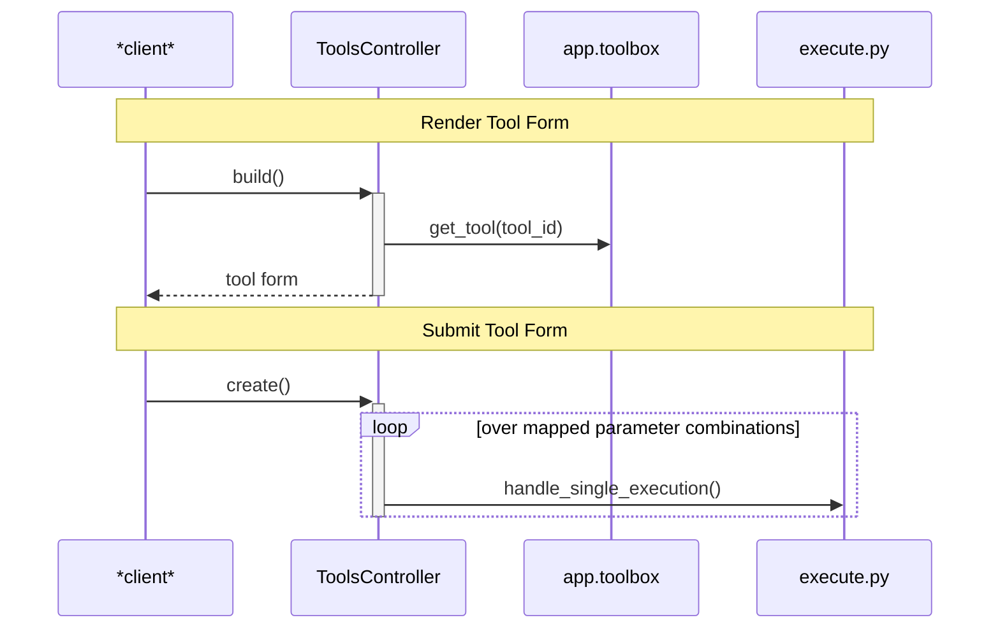
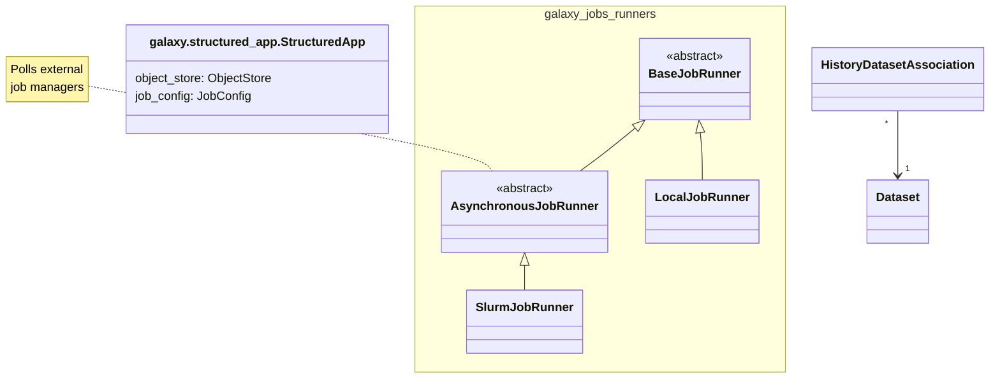
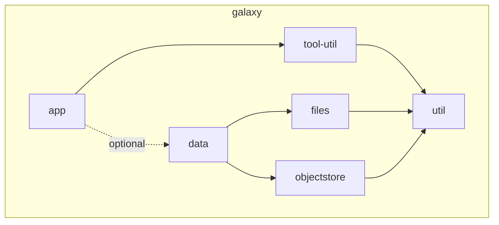

# Diagram Guide

Reference for creating effective diagrams in Galaxy architecture documentation. Used by `/plan-a-topic` command.

All diagrams are [Mermaid](https://mermaid.js.org/) (matching Galaxy's own docs). Sources live in `images/`; `make images` renders them to SVG with the Galaxy theme in `images/mermaid_config.json`.

## Philosophy

Choose the diagram type that best communicates your point. These are patterns we've found effective - not rules. If a different diagram type serves your purpose better, use it.

## Diagram Types We Use

| Type | Mermaid | Purpose | Examples |
|------|---------|---------|----------|
| **Sequence** | `sequenceDiagram` | Call chains, request flows | asgi_app, core_tool_sequence, core_backend_celery |
| **Class/Object** | `classDiagram` | Data models, inheritance | core_runner_classes, hda_dataset, objectstore |
| **Component** | `flowchart` + `subgraph` | Package dependencies, deployment | core_packages, file_sources_posix_deployment |
| **Activity** | `flowchart TD` | Decision processes | file_sources_access_control |
| **File Tree** | `treeView-beta` (from YAML) | Directory structure (validated) | core_files_ci, core_files_code |
| **Concept Mindmap** | `mindmap` (from YAML) | Abstract relationships | markdown_design_principles, core_plugins_overview |
| **Timeline / State / Gantt** | `timeline`, `stateDiagram-v2`, `gantt` | Evolution, lifecycles, plans | - |

## Sequence Diagrams

Trace call chains through the system. Show what calls what and in what order.

### When to Use
- Request handling flow (browser → controller → manager)
- Tool execution pipeline
- Task processing (Celery flows)
- Any multi-component interaction

### Example

```mermaid
sequenceDiagram
    participant client as *client*
    participant ToolsController
    participant toolbox as app.toolbox
    participant execute as execute.py

    Note over client,execute: Render Tool Form
    client->>+ToolsController: build()
    ToolsController->>toolbox: get_tool(tool_id)
    ToolsController-->>-client: tool form

    Note over client,execute: Submit Tool Form
    client->>+ToolsController: create()
    loop over mapped parameter combinations
        ToolsController->>execute: handle_single_execution()
    end
    deactivate ToolsController
```

**Key patterns:**
- `->>` for calls, `-->>` for returns; `+`/`-` suffixes (or `activate`/`deactivate`) for lifelines
- `Note over A,B: Phase` spanning all participants separates phases (Mermaid has no `== Section ==`)
- `loop`, `alt`/`else`, `opt` for control flow; `box Name ... end` to group participants
- Show data types passed between components (e.g., "pydantic", "json")
- Use `<br>` for line breaks in labels and notes

## Class/Object Diagrams

Show type hierarchies, model relationships, and interface structure.

### When to Use
- Plugin/runner inheritance hierarchies
- Data model relationships (HDA ↔ Dataset)
- Interface layering (StructuredApp hierarchy)
- Abstract class → concrete implementations

### Example

```mermaid
classDiagram
    namespace galaxy_jobs_runners {
        class BaseJobRunner {
            <<abstract>>
        }
        class AsynchronousJobRunner {
            <<abstract>>
        }
        class LocalJobRunner
        class SlurmJobRunner
    }
    class StructuredApp["galaxy.structured_app.StructuredApp"] {
        object_store: ObjectStore
        job_config: JobConfig
    }
    BaseJobRunner <|-- AsynchronousJobRunner
    BaseJobRunner <|-- LocalJobRunner
    AsynchronousJobRunner <|-- SlurmJobRunner
    HistoryDatasetAssociation "*" --> "1" Dataset
    note for AsynchronousJobRunner "Polls external<br>job managers"
```

**Key patterns:**
- `namespace` groups classes (identifiers can't contain dots - use underscores). Name it after the real package (`galaxy_files_sources`) - `make validate-files` checks the package exists and defines its classes
- Dotted module paths go in a label: `class Short["galaxy.module.Short"]`
- `<<abstract>>`, `<<interface>>`, `<<Protocol>>` stereotypes; `method()*` marks abstract methods
- Cardinality on relationships: `A "*" --> "1" B`
- Free-text commentary goes in `note for X "..."` (class bodies hold members only)
- Show only key methods/attributes (don't list everything)

## Component Diagrams

Show package/module dependencies. Good for understanding build structure.

### Example

```mermaid
flowchart TB
    subgraph galaxy
        util
        files
        data
        objectstore
        tool_util["tool-util"]
        app
    end
    tool_util --> util
    files --> util
    objectstore --> util
    data --> objectstore
    data --> files
    app --> tool_util
    app -. optional .-> data
```

**Key patterns:**
- `subgraph id["Label"] ... end` for packages, servers and folders (subgraphs can't take shapes)
- Leaf shapes: `db[("Database")]`, `f@{ shape: doc, label: "file.txt" }`
- Notes: `n1@{ shape: comment, label: "..." }` linked with `-.-`
- `-.->` for optional dependencies
- If the layout tangles, add front-matter `config: {layout: elk}`

## File Trees (Validated)

**Primary use case:** Show directory/file structure with documentation.

These are YAML files (`name.mindmap.yml`) that:
1. Are validated against a Galaxy checkout (`scripts/check_mindmap_paths.py`)
2. Generate a Mermaid `treeView-beta` directory listing (`images/mindmap_yaml_to_mermaid.py`)
3. Include documentation for each entry

### Example
```yaml
# core_files_code.mindmap.yml
label: /
items:
- label: lib/
  doc: root of monolithic Python backend
  items:
  - label: galaxy/
    doc: most of the code that makes up the backend
- label: client/
  doc: Galaxy frontend project
```

**Key patterns:**
- Root `label` is a path (`/`, `/client`, `/lib/galaxy/managers`) - that's what makes it a file tree
- `items:` for children, `doc:` for explanations (rendered as `name  —  doc`)
- Keep structure shallow (2-3 levels max); only include files relevant to the topic

## Concept Mindmaps

Show abstract relationships and categorizations. Same YAML format, but the root label is not a path; renders as a Mermaid `mindmap` with the tidy-tree layout.

```yaml
# markdown_design_principles.mindmap.yml
label: Design Principles
items:
  - label: Lazy Resolution
    doc: Resolve at appropriate boundary, not eagerly
```

The tidy-tree layout alternates siblings left and right. When sibling order matters (e.g. `core_branches`), add `diagram: flowchart` to the YAML to render an ordered left-to-right flowchart instead. `diagram: tree` forces a file tree.

## Diagram Selection Quick Reference

| Showing... | Consider... |
|------------|-------------|
| Call chain / request flow | Sequence Diagram |
| Type hierarchy / inheritance | Class Diagram |
| Package/module dependencies | Component (flowchart) |
| Decision process | Activity (flowchart) |
| File/directory structure | File Tree (YAML) |
| Abstract concepts | Concept Mindmap (YAML) |
| Evolution over time | Timeline |
| State transitions | State Diagram |

These are starting points, not requirements. Use what communicates best.

## Tips for Effective Diagrams

1. **Right tool for the job.** A sequence diagram showing a call chain is clearer than a mindmap listing the same components.
2. **Keep class diagrams focused.** Show only key methods/attributes relevant to the point.
3. **Use activation in sequence diagrams** to show component lifetime.
4. **Separate phases in long sequences** with spanning notes.
5. **Keep file trees shallow.** 2-3 levels, only relevant files, with doc strings.
6. **Keep diagrams small.** Around a dozen primary nodes and one obvious main path; put detail in notes or prose rather than extra edges.

## Style

Don't set themes, colours or `look: handDrawn` per diagram - `images/mermaid_config.json` applies the Galaxy theme (the `themeVariables` from Galaxy's Sphinx `mermaid_config` in #23801, plus `labelTextColor` for readable loop/alt labels). Use `classDef` only when colour carries meaning.

## File Naming and Building

- Mermaid: `name.mmd` → `make images` generates `name.mmd.svg`
- YAML: `name.mindmap.yml` → generates `name.mindmap.mmd` → `name.mindmap.mmd.svg`
- Rendered SVGs and generated `.mindmap.mmd` files are gitignored and built in CI.
- Reference from content as ``.

Requires mermaid-cli: `npm install` (uses `package.json`; the Makefile prefers `node_modules/.bin/mmdc` over a global install). `make watch-images` rebuilds on change.

## Diagram TODO Format for Planning

When proposing diagrams in slide plans:

```markdown
**Diagram TODO:** Sequence diagram showing tool execution
- Participants: client, ToolsController, app.toolbox, tool, execute.py
- Two phases: "Render Form" and "Submit Form"
- Show loop for parameter combinations
- Reference: images/core_tool_sequence.mmd (similar pattern)
```

Include:
1. Diagram type
2. Key participants/components
3. Main sections/phases
4. Reference to similar existing diagram if applicable
