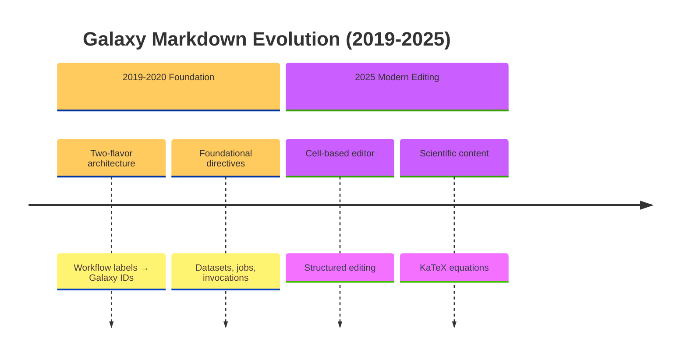

# Mermaid Diagram Support

## Overview

The images/ directory now supports both PlantUML and Mermaid diagram formats:

- **PlantUML** (`.plantuml.txt`) - Class diagrams, activity diagrams, sequence diagrams, component diagrams
- **Mermaid** (`.mermaid.txt`) - Timelines, Gantt charts, flowcharts, state diagrams, user journeys

## File Naming Convention

Following the PlantUML pattern:

- **PlantUML sources:** `diagram_name.plantuml.txt` → generates `diagram_name.plantuml.svg`
- **Mermaid sources:** `diagram_name.mermaid.txt` → generates `diagram_name.mermaid.svg`
- **Mindmap YAML:** `diagram_name.mindmap.yml` → generates `diagram_name.mindmap.plantuml.txt` → `diagram_name.mindmap.plantuml.svg`

## Installation

### PlantUML (automatic)
PlantUML jar is downloaded automatically on first build.

### Mermaid CLI (automatic via npm)
```bash
# Install project dependencies (includes mermaid-cli)
make setup
# or manually:
npm install
```

**Alternative: Global Install**
```bash
npm install -g @mermaid-js/mermaid-cli
```

**Note:** Mermaid diagrams are optional. If `mmdc` is not installed, the build will skip Mermaid diagram generation with a warning but continue successfully. The Makefile prefers local `node_modules/.bin/mmdc` over global install.

## Building Diagrams

```bash
# Build all diagrams (PlantUML + Mermaid)
make images

# Watch for changes
make watch-images
```

## When to Use Each

### Use PlantUML for:
- **Class diagrams** - Code structure, relationships
- **Component diagrams** - Architecture, dependencies
- **Activity diagrams** - Process flows, algorithms
- **Sequence diagrams** - API interactions, call flows
- **Mindmaps** (via YAML) - Hierarchical concepts

### Use Mermaid for:
- **Timeline diagrams** - Feature evolution, historical progression
- **Gantt charts** - Project planning, milestones
- **Flowcharts** - Decision trees, user flows
- **State diagrams** - State machines, lifecycle
- **User journey maps** - UX flows, personas

## Example: Timeline Diagram



Save as `images/markdown_timeline.mermaid.txt` and run `make images`.

## Referencing in Content

In `content.yaml`:

```yaml
- type: slide
  id: timeline
  heading: "Evolution Timeline"
  content: |
    
```

## Why Both?

- **PlantUML** is mature, great for technical diagrams (UML), extensive customization
- **Mermaid** has better support for modern diagram types (timelines, Gantt), simpler syntax
- Both generate SVG for crisp rendering in slides and docs
- Both integrate with the same build pipeline

## Troubleshooting

**Mermaid diagrams not generating?**
```bash
# Check if mmdc is installed locally
ls node_modules/.bin/mmdc

# Check if mmdc is installed globally
which mmdc

# Install project dependencies (preferred)
make setup

# Or install globally
npm install -g @mermaid-js/mermaid-cli

# Rebuild
make clean
make images
```

**PlantUML failing?**
```bash
# Check Java
java -version

# Manually download PlantUML jar
cd images
make plantuml.jar
```
